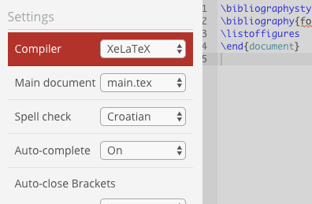

# Foi TeX  template 

I was too lazy to write my entire thesis from scratch in MS Word :fire: so I made this template.

# Note: This is NOT the official template. Use at your own risk :fire:!

Template for master thesis for [Faculty of Organization and Informatics](http://www.foi.unizg.hr/). 

Inspired by docx template found [here](https://www.google.hr/url?sa=t&rct=j&q=&esrc=s&source=web&cd=1&cad=rja&uact=8&ved=0ahUKEwiDzaWow_DQAhXIXBoKHR0IBJcQFggaMAA&url=http%3A%2F%2Fwww.foi.unizg.hr%2Fsites%2Fdefault%2Ffiles%2Fpredlozak_zavrsni_diplomski_rad_final.docx&usg=AFQjCNGVL532bxol83zfj2y2EgYlY3jPEA&sig2=-l8_ze1uGl3aqvCLb6liNQ).

Thanks to [mschatten](https://github.com/mschatten) for creating initial version of this template. 

### Usage

Create new [ShareLatex](https://www.sharelatex.com/) project and import code from this repo.

Use **XeLatex** to compile (because of **Arial** and **Times New Roman** font).

It's not enabled by default so you have to change it in settings manually:

This template is completely adjusted to be used with:

* [ShareLatex](https://www.sharelatex.com/)

### Result
[Viola!](https://github.com/lpredova/foi-latex-master-thesis/blob/master/foi.pdf)

---
Lovro Predovan 2017

